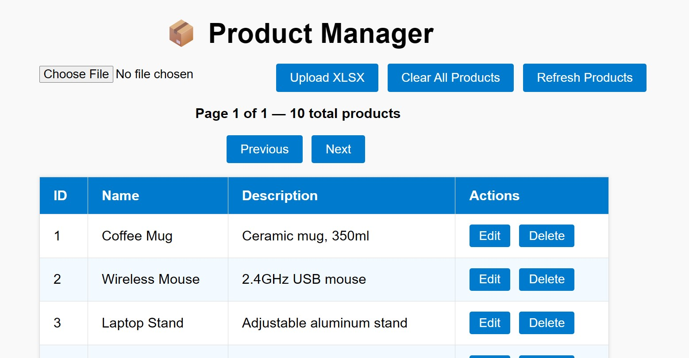
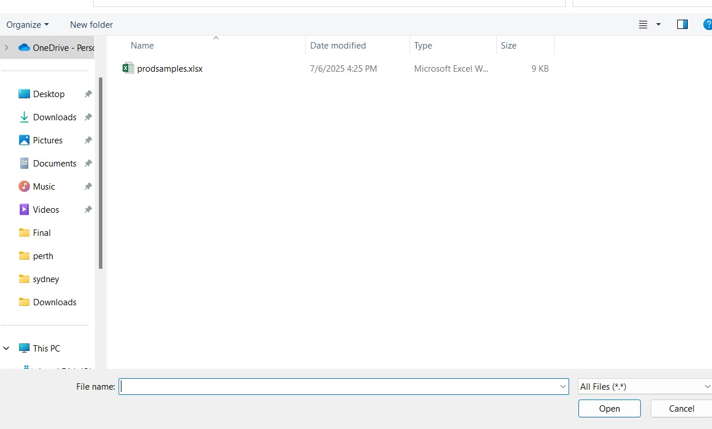
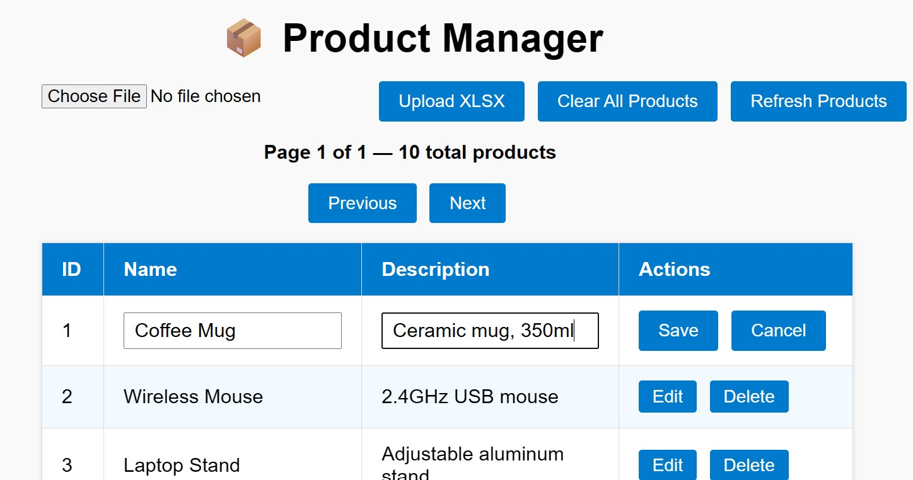
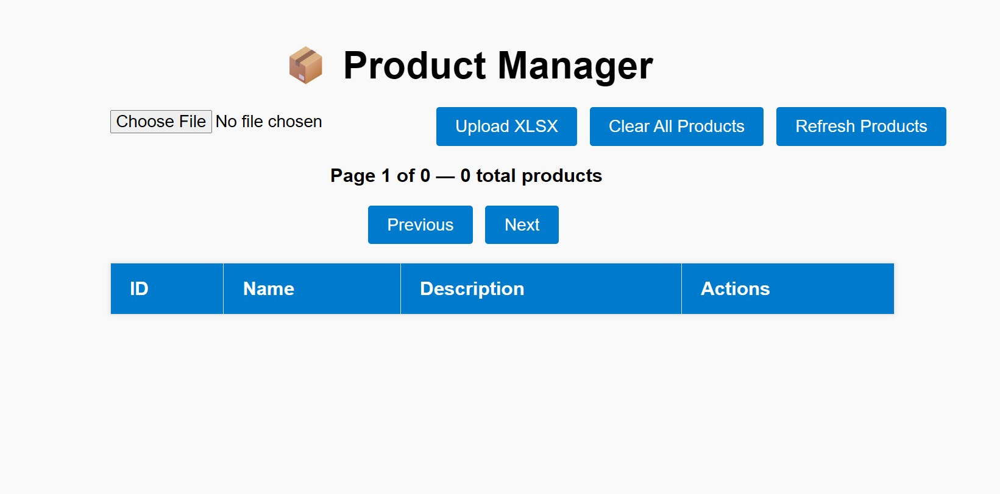

# Product Manager App

A simple CRUD app built with FastAPI backend + vanilla JS frontend.

## Features

- Upload Excel (.xlsx) file with products
- List products with pagination
- Inline edit & delete
- Clear all products at once

## Screenshots

1️ Home page  


2 Upload Excel  


3 Edit product  


4 Clear all products  


## How to Run

1. Start backend:  
   ```bash
   uvicorn main:app --reload
